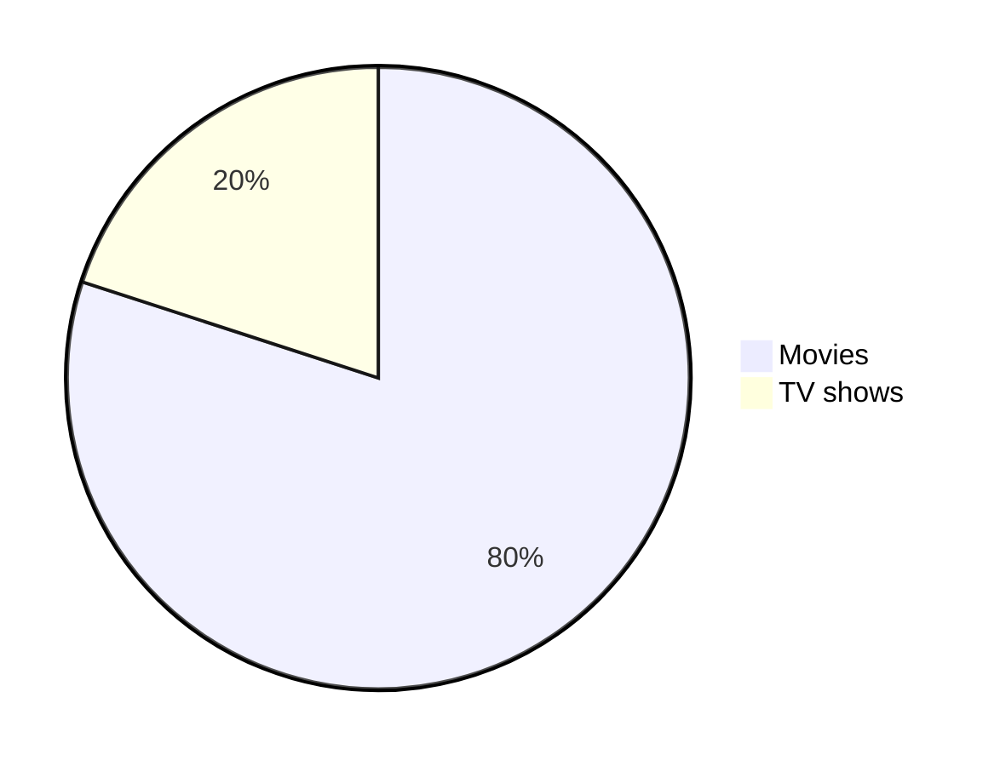

# TESTING OUT .github workflows

>
> .yaml files can be used to automate TESTING
>

* I am also messing around with markdown

Here is one of my favorite resources I have **STARRED** [Markdown-Cheatsheet](https://github.com/lifeparticle/Markdown-Cheatsheet) it has a ton of cool information.

Some examples are: 

1. *Badges*: 

2. *Diagrams*

3. *emojis*

🦥 :sloth:
🐕‍🦺 :service_dog:
🦕 :sauropod:
🥫 :canned_food:
🧈 :butter:
🧁 :cupcake:
🍮 :custard:
🥞 :pancakes:
🪀 :yo_yo:
🌃 :night_with_stars:
🪔 :diya_lamp:
⚱️ :funeral_urn:
🧼 :soap:

4. *collapsible menus*

  
Menu

-  <kbd>Should</kbd>
-  <kbd>Be</kbd>
-  <kbd>Working</kbd>

# AND SO MUCH MORE...

